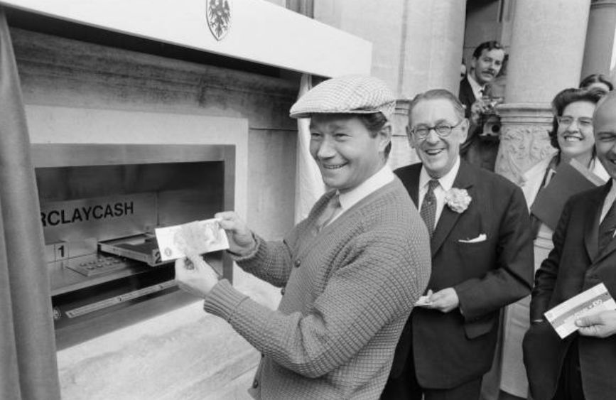

# __1967 First Cash Machine__
### __James Goodfellow__ (b. 1937), __John Shepherd-Barron__ (1925–2010), __Donald Wetzel__ (b. 1921), __Luther George Simjian__ (1905–1997)
___

Tidak ada satu pun penemu mesin anjungan tunai mandiri (ATM), meskipun sudah banyak orang yang mencoba mengklaimnya. Sebaliknya, itu adalah hasil dari serangkaian inovasi oleh banyak orang selama bertahun-tahun, yang mengarah pada peluncuran penting tahun 1967 dari dua mesin yang bersaing tetapi berbeda di Inggris yang diperkenalkan dalam waktu satu bulan satu sama lain.

Mesin James Goodfellow, yang diperkenalkan oleh Westminster Bank di London, menggunakan kartu plastik dan nomor identifikasi pribadi (PIN) untuk verifikasi dan akses pelanggan. Mesin John Shepherd-Barron, yang diperkenalkan oleh Barclays, menggunakan pemeriksaan radioaktif ringan yang diresapi dengan karbon-14 yang diandalkan ATM untuk dicocokkan dengan nomor identifikasi pelanggan. Sementara mesin Shepherd-Barron mengalahkan Goodfellow ke pasar sebulan (dan dengan demikian menerima banyak kemuliaan "pertama"), itu adalah desain PIN Goodfellow yang macet dan akhirnya melihat komersialisasi dan lisensi massal oleh produsen. Dia juga memiliki paten pertama untuk ATM yang menggunakan PIN untuk otentikasi.

Di Amerika Serikat, ATM dipelopori oleh Donald Wetzel yang bekerja di sebuah perusahaan teknologi bernama Docutel. ATM AS pertama dipasang oleh Chemical Bank di cabang Rockville Centre, New York, pada tahun 1969. Iklan bank untuk kekasih barunya berbunyi, "Pada 2 September, bank kami akan buka pukul 9:00 dan tidak akan pernah tutup lagi." Di Amerika Serikat, ATM dipelopori oleh Donald Wetzel yang bekerja di sebuah perusahaan teknologi bernama Docutel. ATM AS pertama dipasang oleh Chemical Bank di cabang Rockville Centre, New York, pada tahun 1969. Iklan bank untuk kekasih barunya berbunyi, “Pada 2 September, bank kami akan buka pukul 9:00 dan tidak akan pernah tutup lagi.”

Seiring dengan berkembangnya teknologi komputer yang membentuk ATM dan fitur pelanggan yang ditawarkan—magnetic stripes, peningkatan keamanan, mesin yang berdiri sendiri, kemampuan untuk menerima setoran serta membagikan uang tunai, dan seterusnya—definisi dari apa yang sebenarnya sering didefinisikan sebagai ATM. tergantung pada siapa yang membuat klaim, terutama bagi orang yang mengaku sebagai "yang pertama". Misalnya, pada tahun 1939, Luther George Simjian dari Amerika Armenia memiliki ide untuk membuat mesin hole-in-the-wall yang memungkinkan transaksi keuangan. Dia akhirnya akan membuat Bankograph, yang memungkinkan orang melakukan pembayaran tagihan listrik dan mendapatkan tanda terima. Sayangnya, Bankograph gagal. “Sepertinya satu-satunya orang yang menggunakan mesin adalah sejumlah kecil pelacur dan penjudi yang tidak mau berhadapan dengan teller secara langsung,” tulis Simjian dalam otobiografinya.

*Aktor Inggris Reg Varney berpose pada pembukaan ATM pertama di dunia di Barclays Bank di Enfield, Middlesex, tepat di utara London, pada 21 Juni 1967.*