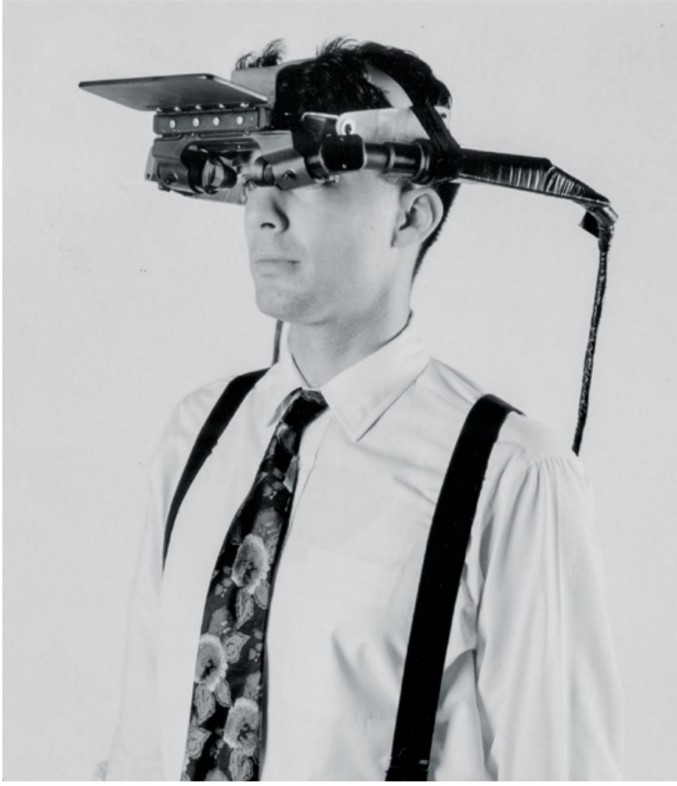

# __1967 Head-Mounted Display__
### __Ivan E. Sutherland__ (b.1938)
___
Head-Mounted Display (HMD) adalah tampilan  video imersif awal dan yang pertama menggunakan komputer alih-alih kamera untuk mensimulasikan ruang fisik. Ini terdiri dari enam bagian: komputer serba guna, pengganda matriks, generator vektor, elektronik khusus yang disebut pembagi kliping yang menghilangkan garis-garis yang tersembunyi di belakang pengamat atau di luar bidang pandang, headset, dan sensor posisi kepala. 

Ada layar di depan mata yang menyajikan gambar yang sedikit berbeda untuk setiap mata, yang menghasilkan rasa kedalaman. Sensor memberi tahu komputer saat Anda menggerakkan kepala, dan komputer memperbarui layar sesuai dengan itu.

Konsep dibalik perangkat Sutherland adalah memungkinkan pengguna untuk mengamati gambar yang bergerak sesuai dengan gerakan kepala mereka sendiri. Perangkat yang memungkinan untuk menampilkan gambar yang bergerak mengikuti gerakan kepala sendiri belum ada, jadi Sutherland dan timnya merancang dan membangun itu.

*Layar yang dipasang di kepala Ivan Sutherland memungkinkan seseorang untuk mengubah arah pandangan mereka dan bahkan bergerak di sekitar ruangan; ketika orang tersebut bergerak, setiap tampilan mata diperbarui sesuai.*
