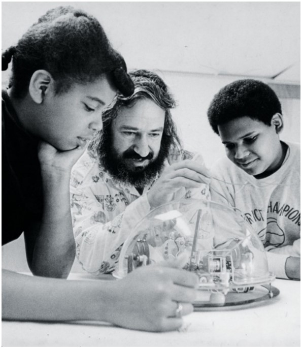

# __1967 Programming for Children__
### __Seymour Papert__ (1928-2016) __,Wally Feurzeig__ (1927-2013) __, Cyntia Solomon__ (dates unavailable)
___
Seymour Papert, Wally Feurzeig, dan Cynthia Solomon berpikir bahwa pemrograman bisa menjadi alat yang ampuh untuk mengajar anak-anak tentang berpikir, merencanakan, dan berpikir abstrak. Jadi saat bekerja di perusahaan riset Bolt, Beranek, dan Newman (sekarang BBN Technologies®) di Cambridge, Massachusetts, mereka merancang bahasa komputer untuk anak-anak, dengan beberapa perintah yang dapat digabungkan untuk memungkinkan tugas-tugas kompleks. Pemrograman dalam bahasa ini, yang disebut **Logo**, memungkinkan anak-anak membuat instruksi untuk komputer sedemikian rupa sehingga mereka dapat merangkai banyak kata sederhana untuk menyampaikan pemikiran yang rumit. Beberapa program awal yang ditulis anak-anak adalah kuis matematika dan chatbot.

Meskipun program dalam versi awal Logo tidak lebih dari berkomunikasi dengan pengguna melalui teks, penemu segera memungkinkan mesin untuk mengontrol robot mekanik yang disebut **turtle**, yang dapat diinstruksikan oleh program untuk bergerak maju, mundur, atau belok. Penyu asli adalah robot bernama Irving; itu merangkak di selembar kertas sebagai tanggapan atas perintah dari mesin di dekatnya. Irving memiliki pena yang bisa dijatuhkan dan diseret untuk membuat gambar. Akhirnya, Irving menjadi kura-kura virtual di layar komputer, memungkinkan untuk berbagi Logo dengan lebih banyak orang.

Anak-anak diajari bahwa kura-kura memahami kata-kata dan angka-angka tertentu yang dapat mereka gunakan untuk membuat kura-kura bergerak. Untuk menggambar persegi, misalnya, seorang anak akan belajar melalui trial and error untuk mengetik **FORWARD 40** (atau nomor lain) untuk maju 40 langkah, kemudian ketik perintah **RIGHT 90** untuk berbelok ke kanan, dan kemudian **FORWARD 40** dan **RIGHT 90** tiga kali lagi untuk melengkapi bentuknya. Anak akan mendapatkan umpan balik visual langsung di layar.

Anak-anak segera belajar bahwa mereka dapat “mengajari” kura-kura kata baru seperti **KOTAK** dan mengasosiasikan langkah-langkah individu dengan kata itu, sehingga mereka tidak perlu mengetikkan banyak perintah untuk membuat objek. Programming ini biasa disebut "turtle-graphics", permainan mengajar dan berbagai bentuk Logo berkembang dari waktu ke waktu dan membuktikan bawha anak-anak dapat memprogram.

*Seymour Papert menunjukkan kepada dua anak cara kerja kura-kura robotik yang dikendalikan oleh program yang ditulis dalam bahasa pemrograman Logo.*
