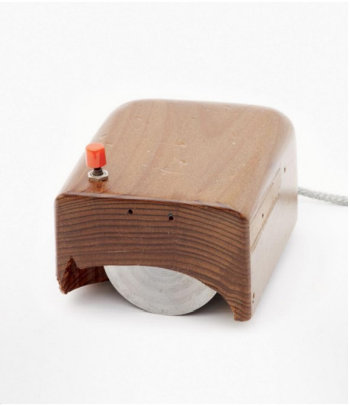

# __1967 The Mouse__
### __Douglas C. Engelbart__ (1925-2013) __,Bill English__ (dates unavailable) 
___
Douglas Engelbart, pelopor dalam bidang interaksi manusia-komputer, umumnya dikreditkan dengan menemukan mouse pada awal 1960-an, memproduksi prototipe pertama pada tahun 1964 dan memperkenalkannya kepada publik pada tahun 1968 sampai kemudian dikenal sebagai " Ibu dari Semua Demo.” Dia mematenkannya dengan Bill English, seorang rekan kerja di Stanford Research Institute (SRI). Ide Engelbart berkontribusi pada pengejaran yang sudah berkembang untuk menyesuaikan gerakan tangan pengguna ke lokasi tertentu dalam ruang dua dimensi seperti yang divisualisasikan di layar komputer. Dalam paten 1967, Engelbart menggambarkan mouse sebagai "**indikator posisi XY** pada tampilan sistem ."

Asal-usul awal mouse dapat dilihat di bola roller Ralph Benjamin, diakui sebagai asal trackball modern. Tidak seperti trackball, yang tidak bergerak dan mengharuskan pengguna untuk menggerakkan tangan dan jari di atasnya, mouse mengharuskan seluruh perangkat diposisikan ulang.

Mouse Engelbart terdiri dari kotak kayu dengan tiga tombol di atas dan dua roda di bawah yang diposisikan pada sudut kanan untuk mengontrol gerakan horizontal dan vertikal. Saat roda berputar, jarak dan lokasi ditangkap sebagai kode biner di komputer, yang diterjemahkan ke dalam output visual di layar. Engelbart menemukan mouse untuk mengontrol navigasi pada sistem kolaborasi komputer inovatif yang ia rancang yang disebut **oN-Line System (NLS).**

Mouse Engelbart adalah bagian dari visi yang lebih besar yang dia miliki untuk membuat komputer lebih interaktif dan dapat diakses oleh semua orang.

*Replika prototipe mouse Engelbart, dibuat oleh insinyur Bill English, 1964*
