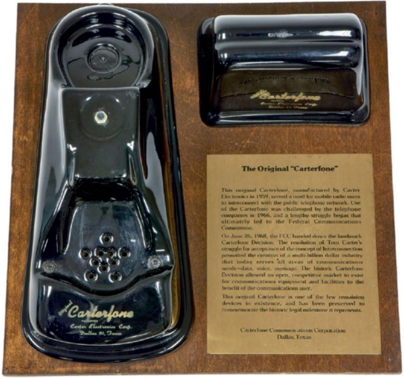

# __1968 Carterfone Decision__
### __Thomas Carter__ (1924-1991)
___
Ketika seorang pekerja minyak Texas ingin berkomunikasi dari lokasi terpencil seperti ladang minyak, dia menggunakan radio jarak jauh untuk berbicara dengan orang lain karena tidak ada saluran telepon di tempat-tempat terpencil seperti itu. Sementara itu, keluarga, teman, dan kolega memiliki telepon, tetapi tidak memiliki radio.

Thomas Carter, pengusaha Texas dan penemu yang menciptakan Carterfone, perangkat yang menghubungkan radio dua arah ke jaringan telepon, memungkinkan mereka yang berada di tempat yang jauh untuk tetap berhubungan dengan orang lain.

Carterfone bekerja dengan akustik (berlawanan dengan elektrik) menghubungkan radio ke jaringan telepon umum. Setelah operator stasiun melakukan kontak dengan pihak-pihak di kedua ujungnya—operator radio dan orang di ujung telepon yang lain—operator akan menempatkan handset telepon ke dalam dudukan, yang menyelaraskan speaker kecil dengan mikrofon handset dan mikrofon dengan speaker handset. Sakelar yang dioperasikan dengan suara di Carterfone kemudian akan secara otomatis menyalakan pemancar radio ketika orang di telepon berbicara. Ketika orang itu berhenti berbicara, Carterfone akan berhenti mentransmisikan. Mikrofon perangkat kemudian akan mengambil suara apa pun yang diterima oleh penerima radio dan mengirimkannya ke saluran telepon. Hal ini memungkinkan kedua belah pihak untuk mendengar satu sama lain dan berbicara.

Meskipun Carterfone tidak terhubung secara elektrik ke sistem telepon, itu melanggar aturan perusahaan telepon. Pada tahun 1968, AT&T mengendalikan sistem telekomunikasi AS, dengan Western Electric® sebagai produsen yang memproduksi semua peralatan. Tidak ada yang memiliki ponsel mereka: mereka disewa. Aturan AT&T melarang pengguna memasang perlengkapan pihak ketiga ke jaringannya. Jadi Carter mengajukan gugatan terhadap AT&T, dan—yang mengejutkan banyak orang-Komisi Komunikasi Federal (FCC) memutuskan untuk mendukung Carter.

Keputusan penting FCC ini adalah pengingat bahwa peraturan terkadang diperlukan untuk melindungi dan mengaktifkan inovasi yang mengarah pada kemajuan teknologi. Tanpa keputusan Carterfone FCC, inovasi seperti mesin faks, mesin penjawab, dan modem tidak akan memiliki ruang regulasi untuk memasuki pasar dan berkembang, membuka jalan bagi apa yang akan menjadi internet dan ekosistem komunikasi dinamis yang ada saat ini.

*Carterfone asli, yang menghubungkan radio seluler ke jaringan telepon*
