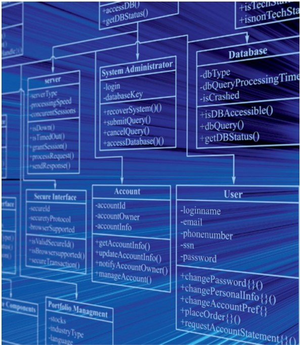

# __1968 Software Engineering__
### __Peter Naur__ (1928-2016) __, Brian Randell__ (b.1936)
___
Beberapa pionir komputasi mengantisipasi betapa rumitnya perangkat lunak, karena mereka sebagian besar membangun perangkat keras. Ada logika untuk perangkat keras komputer, tidak peduli apakah itu dibangun dengan relai, tabung, atau transistor. Perangkat keras mengeksekusi satu instruksi pada satu waktu, dan pengoperasian setiap instruksi dapat dianalisis secara individual dan terbukti benar. Kesalahan desain perangkat keras relatif mudah dideteksi dan diperbaiki.

Perangkat lunak sama sekali berbeda karena bersifat dinamis. Pemrogram tidak hanya perlu menentukan instruksi yang benar, tetapi juga menentukannya dalam urutan yang benar, dan urutan itu dapat berbeda dengan data yang berbeda. Beberapa programmer dapat menangkap beberapa kesalahan ketika mereka menulis kode, tetapi proses itu lambat dan rawan kesalahan itu sendiri, karena banyak kesalahan tidak terlihat sampai program berjalan.

Pada bulan Oktober 1968, Organisasi Perjanjian Amerika Utara (NATO) Komite Sains mengadakan Konferensi Kerja selama seminggu tentang Rekayasa Perangkat Lunak di Garmisch, Jerman, untuk mengatasi krisis perangkat lunak yang berkembang. Lima puluh pakar dari seluruh dunia hadir. Konferensi ini secara luas dikreditkan dengan mempopulerkan istilah **Software Engineering** dan menetapkannya sebagai subjek studi akademis yang serius.

Laporan Januari 1969 yang dihasilkan, diedit oleh ilmuwan komputer Peter Naur dan Brian Randell, mengidentifikasi lima bidang utama di mana pekerjaan diperlukan: hubungan antara perangkat lunak dan perangkat keras komputer, desain perangkat lunak, produksi perangkat lunak, distribusi perangkat lunak, dan layanan perangkat lunak.

Pada tahun-tahun sejak itu, banyak organisasi telah mengidentifikasi kebutuhan akan rekayasa perangkat lunak, namun hanya sedikit yang menguasai kemampuan untuk melakukannya dengan baik.

*Diagram entitas hubungan ini menunjukkan betapa berbedanya tabel dalam manajemen portofolio online sistem terstruktur dan jelas*
