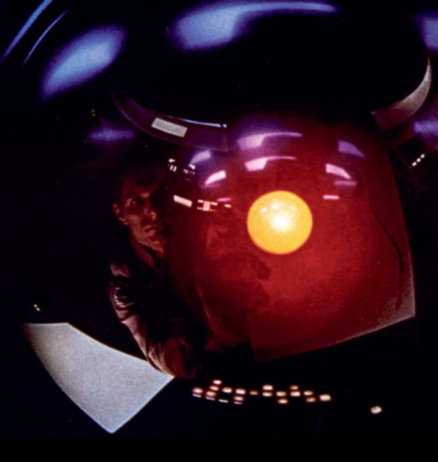

# __1968 HAL 9000 Computer__
### __Stanley Kubrick__ (1928-1999) __, Arthur C.Clarke__ (1917-2008) __, Douglas Rain (b.1928)__
___
HAL 9000 (komputer ALgoritmik yang diprogram secara Heuristik ) adalah komputer yang sadar diri dan cerdas secara artifisial yang mengontrol pesawat ruang angkasa **Discovery** dalam film **2001: A Space Odyssey.** 

Secara visual, HAL direpresentasikan dalam film sebagai kamera televisi berwarna merah. Keterampilan HAL termasuk penalaran dan percakapan seperti manusia, penglihatan buatan, pengenalan wajah, interpretasi emosional, pendapat tentang topik yang sangat subjektif termasuk apresiasi seni, dan pemahaman tentang interaksi manusia.

HAL "adalah komputer pertama yang menjadi kepribadian terkenal dan menjadi bagian dari mitologi publik," kata Clarke dalam sebuah wawancara tahun 1992 dengan *Chicago Tribune*

Film ini menimbulkan pertanyaan tentang ke mana arah teknologi dan konsekuensi potensial dari pengembangan entitas buatan yang dapat melampaui kecerdasan manusia.

*Sebuah film dari tahun 2001: A Space Odyssey, menampilkan HAL 9000 yang digambarkan sebagai kamera televisi berwarna merah.*
