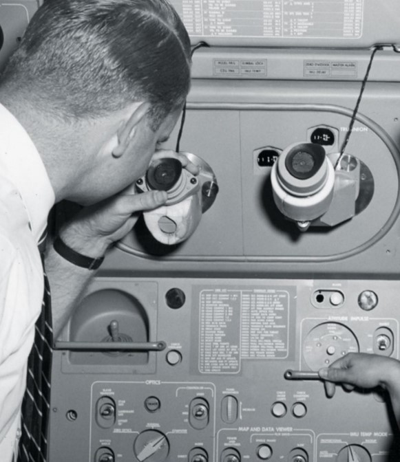

# __1968 First Spacecraft Guided by Computer__
### __Margaret Hamilton__ (b.1936) 
___
Pada tanggal 25 Mei 1961, Presiden John F. Kennedy berjanji untuk mengirim seorang Amerika ke bulan sebelum akhir dekade. Segera setelah itu, Laboratorium Instrumentasi MIT menandatangani kontrak dengan Badan Penerbangan dan Antariksa Nasional (NASA) untuk merancang dan mengembangkan penerbangan dengan sistem panduan.

Sistem yang diproduksi MIT disebut Apollo Guidance Computer (AGC). Itu memiliki sistem operasi real-time dan 32.768 bit memori inti, dioperasikan pada 43 kilohertz (0,043 megahertz), dan termasuk sirkuit terpadu daripada transistor. Hebatnya, dengan sepersejuta daya penyimpanan dan komputasi ponsel modern, AGC membawa astronot Apollo 11 ke bulan dan kembali dengan selamat-totalnya sekitar setengah juta mil.

Margaret Hamilton, 24 tahun, memimpin programmer yang menciptakan perangkat lunak penerbangan onboard untuk modul perintah Apollo dan modul lunar. Karyanya membantu mempercepat kemajuan untuk seluruh industri dan, dalam pergantian peristiwa yang unik, kemungkinan menyelamatkan nyawa astronot Apollo 8. Seperti ceritanya, putri muda Hamilton, Lauren, sedang bermain dengan simulator modul perintah dan menabraknya dengan menekan tombol yang menjalankan program P01, yang seharusnya dijalankan hanya sebelum peluncuran.NASA tidak akan membiarkan Margaret menambahkan kode ke sistem untuk mencegah hal ini terjadi dalam penerbangan, karena pelatihan ekstensif astronot seharusnya mencegah kecelakaan seperti itu. Jadi Hamilton menambahkan catatan pemrograman sebagai gantinya.

*Sextant dari sistem Apollo Guidance and Navigation digunakan untuk membuat pengukuran yang tepat dari bintang-bintang dari modul perintah, yang kemudian dimasukkan ke dalam Apollo Guidance Computer.*
