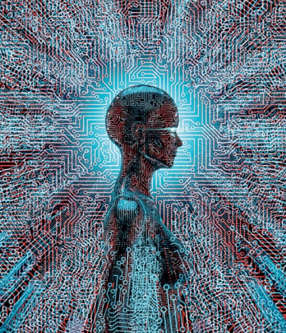

# __1968 *Cyberspace* Coined-and Re-Coined__
### __Margaret Hamilton__ (b.1936) 
___
Menurut **Oxford Dictionaries Online**, istilah **cyberspace** mengacu pada "lingkungan nosional di mana komunikasi melalui jaringan komputer terjadi." Definisi ini berasal dari penggunaan kata oleh penulis William Gibson dalam cerita pendeknya tahun 1982, "Burning Chrome," di mana ia menggambarkan dunia maya sebagai "halusinasi konsensual yang dialami setiap hari oleh miliaran operator yang sah, di setiap negara" dan "representasi grafis dari data yang diabstraksikan dari bank setiap komputer dalam sistem manusia.”

Penggunaan kata secara luas benar-benar digunakan setelah novel tekno-futuristik Gibson yang sangat populer, **Neuromancer (1984).** Media menangkap istilah tersebut dan mengembangkannya menjadi ekspresi umum untuk menggambarkan perubahan cepat yang terjadi dalam teknologi, termasuk fenomena aktivitas sosial yang terjadi di lingkungan nonfisik.

Tetapi definisi modern dari **cyberspace** ditelusuri ke tahun 1982, kata itu sendiri muncul secara singkat pada tahun 1968, ketika seniman visual Denmark Susanne Ussing dan Carsten Hoff menamakan diri mereka *Atelier Cyberspace* dan memasukkan kata itu ke dalam serangkaian karya seni fisik berjudul *Sensory Spaces*, sebagai dilaporkan pada 2015 di majalah seni Norwegia *Kunstkritikk.*

Wiener mendefinisikan cybernetics dalam bukunya tahun 1948 dengan nama itu sebagai "studi ilmiah tentang kontrol dan komunikasi pada hewan dan mesin." Yang menarik bagi Ussing dan Hoff adalah pameran 1968 yang mereka lihat di London berjudul **Cybernetic Serendipity.** Hoff menggambarkan pameran itu sebagai "potensi seni untuk menggunakan teknologi modern, khususnya teknologi informasi." 

*Istilah *cyberspace* berasal dari tahun 19968, ketika seniman Denmark Susanne Ussing dan Carsten Hoff memasukkan kata tersebut kedalam serangkaian karya seni.*
