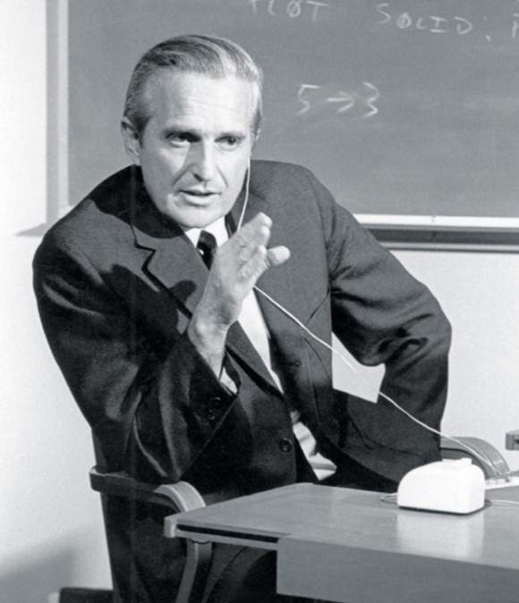

# __1968 Mother of All Demos__
### __Douglas C. Engelbart__ (1925-2013) 
___
Pada tanggal 9 Desember 1968, sebuah tim di Stanford Research Institute (SRI) secara terbuka mendemonstrasikan sistem komputer yang memungkinkan berbagi pengetahuan, pembuatan konten, dan kolaborasi pribadi, yang belum pernah dilihat siapa pun sebelumnya. Sejak itu dikenal sebagai "Mother of All Demos," menampilkan aplikasi alat dan konsep yang sekarang dikenal sebagai hypertext, pengolah kata, pengeditan waktu nyata, berbagi file, telekonferensi, beberapa tampilan jendela, dan navigasi grafis menggunakan perangkat yang disebut seekor tikus. Orang di balik desain sistem yang disebut Sistem oN-Line adalah Douglas Engelbart, seorang penemu dan insinyur perintis di bidang interaksi manusia-komputer.

Seperti orang lain dari generasinya, Engelbart sangat dipengaruhi oleh esai Vannevar Bush "As We May Think," yang meletakkan cetak biru untuk mesin komputasi interaktif yang akan meningkatkan kualitas kinerja manusia dalam tugas-tugas intelektual dan memungkinkan orang untuk memanfaatkan lebih besar jumlah pengetahuan yang luar biasa yang mereka miliki. Hari ini Anda dapat menemukan salinan esai Bush Engelbart yang sangat beranotasi di arsip Engelbart, yang menunjukkan bagaimana dia menggalinya untuk ide-ide yang kemudian dia terapkan.

NLS adalah mekanisme untuk menerapkan tujuan yang lebih luas yang dikejar Engelbart sepanjang hidupnya: untuk meningkatkan kerja sama dan kolaborasi di antara orang-orang untuk memecahkan masalah paling menantang yang dihadapi dunia dan memungkinkan umat manusia mencapai potensi penuhnya. Karya tersebut membuat Engelbart mendapatkan penghargaan Turing AM 1997.

Mother of All Demos menginspirasi generasi teknologi dan penemuan berikutnya, termasuk Xerox Alto pada tahun 1973, sebuah PC yang akan memengaruhi desain dan antarmuka Apple Macintosh. Sebagai catatan, Stewart Brand-pencipta *Whole Earth Catalogue*, sebuah publikasi yang berfokus pada komunitas bersama dan tujuan kolektif-mengoperasikan kamera video selama demonstrasi di Menlo Park.

*Demonstrasi Douglas Engelbart tentang antarmuka pengguna grafis pertama menggerakkan apa yang menjadi revolusi komputer pribadi*
