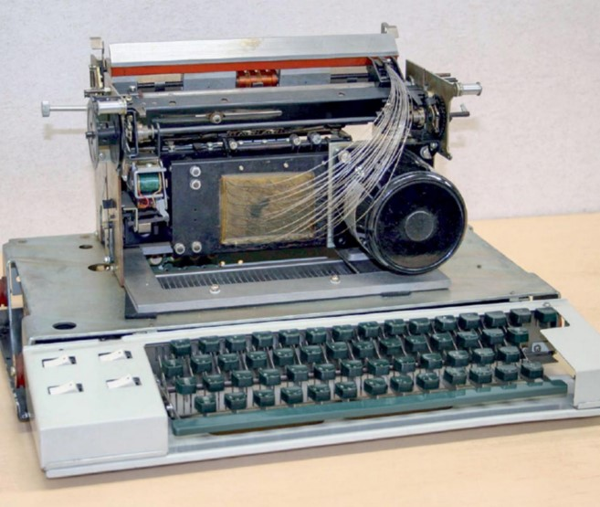

# __1968 Dot Matrix Printer__
### __Rudolf Hell__ (1901-2002) __, Fritz Karl Preikschat__ (1910-1994)
___
Printer dot matrix menggunakan sekelompok titik yang berjarak dekat untuk membentuk huruf individual. Setiap titik dapat dikontrol oleh printer, memungkinkan printer menghasilkan teks dalam gaya huruf apa pun dan ukuran apa pun; mereka juga dapat membuat grafik yang rumit. Sebaliknya, printer kontemporer lainnya, seperti mesin tik listrik terkomputerisasi dan printer typeball dan "daisy wheel", semua huruf yang dicap seluruhnya terbentuk dari cetakan.

Untuk membuat titik-titik, pin atau batang logam kecil secara mekanis didorong ke depan terhadap pita atau kain yang direndam tinta yang membuat kontak fisik dengan kertas. Elektromagnet kecil yang disebut solenoida menggerakkan gerakan maju pin terhadap pelat pemandu dengan lubang kecil untuk membantu mengarahkan pin ke tempat yang tepat. Kualitas cetak printer dot matrix sangat bergantung pada jumlah pin yang digunakan untuk mentransfer gambar, yang biasanya 7 hingga 24, untuk resolusi maksimum sekitar 240 titik per inci (dpi). Kecepatan berkisar dari 50 hingga 500 karakter per detik (cps).

Kelahiran printer dot matrix modern umumnya dipahami telah terjadi di Jepang pada tahun 1968 dengan diperkenalkannya perusahaan Shinshu Seiki EP-101 (kemudian EPSON®) dan printer Wiredot OKI Data Corporation pada tahun yang sama. Perangkat sebelumnya, seperti teletypewriter Hellschreiber 1929 milik Rudolf Hell, mengirim kumpulan titik mentah dari satu mesin ke mesin lainnya dan lebih tepat dianggap sebagai mesin faksimili.

Printer pelepasan elektrostatis (yang mencetak pada kertas perak), printer termal (biasanya digunakan untuk penerimaan kartu kredit), dan printer inkjet semuanya pada dasarnya printer dot matrix, tetapi dengan berbagai jenis mekanisme untuk mentransfer titik ke kertas. Bahkan printer 3-D dapat dianggap sebagai jenis printer dot matrix khusus yang mencetak satu titik material pada satu waktu.

*Printer Wiredot, diproduksi oleh OKI Electric Industry Co., Ltd., 1968.*
