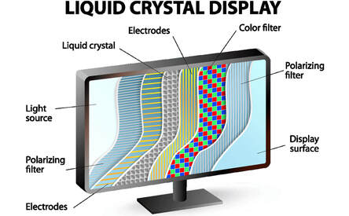

# __1965 First Liquid-Crystal Display__
### __George Heilmeier__ (1936–2014)
____

Keadaan materi kristal cair ditemukan di Karl-FerdinandsUniversität di Praha pada tahun 1888 oleh Friedrich Reinitzer dan diselidiki lebih lanjut pada tahun 1900-an dan 1930-an. Tetapi sebaliknya, kemampuan aneh dari beberapa cairan untuk memiliki sifat kristal khususnya kemampuan untuk mengubah polarisasi cahaya—tetap menjadi keingintahuan kimia, dan bukan subjek eksplorasi atau eksploitasi praktis.

Kemudian, pada awal 1960-an, para insinyur di Laboratorium David Sarnoff RCA di Princeton, New Jersey, mencari jenis layar baru yang dapat menggantikan tabung vakum yang digunakan pada TV berwarna. Ahli kimia fisik RCA® Richard Williams mengalihkan perhatiannya ke kristal cair dan menemukan bahwa bahan kimia tertentu, yang dipanaskan hingga 243° Fahrenheit (117° Celcius), akan mengubah penampilannya dari transparan menjadi buram saat ditempatkan di medan listrik bertegangan tinggi.

Williams soon gave up on the idea of using these crystals for a display, but a young engineer at the company named George Heilmeier saw their promise. Over the following years, Heilmeier and his newly formed research group discovered materials that exhibited the liquid-crystal effect at room temperature and when exposed to very small electric fields.

Kelompok Heilmeier membangun layar kristal cair pertama pada tahun 1965, menggunakan sedikit kristal cair yang diapit di antara polarizer dan permukaan reflektif, yang secara terpisah mengendalikan tujuh segmen layar satu digit; selanjutnya, kelompok tersebut membuat LCD yang menampilkan pola uji TV kecil.

Pada tahun 1971, RCA menjual divisi komputasinya kepada Sperry Rand, dengan menghapus $490 juta. Diragukan bahwa tampilan kristal cair akan menghasilkan uang, RCA menjual teknologi itu pada tahun 1976 ke Timex® untuk jam tangan digitalnya. Saat ini, layar LCD digunakan untuk komputer desktop, telepon portabel, televisi, proyektor, dan banyak lagi.

Heilmeier meninggalkan RCA untuk mendapatkan beasiswa di Gedung Putih, dan pada tahun 1975 ia menjadi direktur Defense Advanced Research Projects Agency (DARPA), di mana ia terus mengawasi pengembangan teknologi atas nama pemerintah AS.

Saat ini, liquid-crystal displays (LCD) umumnya digunakan di layar televisi.
