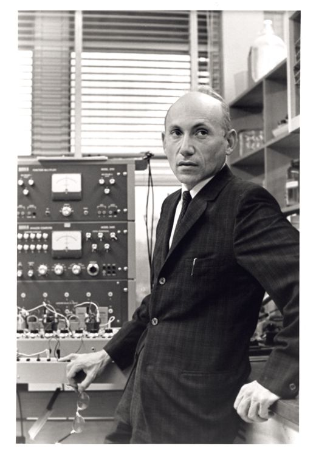

# __1965 DENDRAL__
### __Joshua Lederberg__ (1925–2008), __Bruce G. Buchanan__ (dates unavailable), __Edward Feigenbaum__ (b. 1936), __Carl Djerassi__ (1923–2015)
___

DENDRAL adalah proyek penelitian komputer berpengaruh awal dalam pengembangan sistem AI modern. Ini membantu mengalihkan fokus penelitian AI dari mengembangkan kecerdasan umum ke menciptakan sistem yang disesuaikan untuk area tertentu. Itu dilakukan dengan mewakili pengetahuan para ahli kimia dengan cara yang dapat digunakan oleh komputer, memungkinkan sistem kode dan data untuk memecahkan masalah kimia yang didefinisikan secara sempit dan menarik kesimpulan dengan cara yang sama seperti yang mungkin dilakukan oleh seorang ahli manusia, sehingga menghasilkannya beri nama "sistem pakar".

DENDRAL dimulai pada tahun 1965, ketika ahli genetika Joshua Lederberg sedang mencari platform penelitian berbasis komputer untuk memajukan pemahamannya tentang senyawa organik untuk mendukung penelitian eksobiologinya cabang astrobiologi yang berupaya memahami evolusi kehidupan di planet lain. Lederberg meminta kemitraan asisten profesor Stanford Edward Feigenbaum, salah satu pendiri departemen ilmu komputer sekolah, ahli kimia Stanford Carl Djerassi, dan programmer AI virtuoso Bruce Buchanan untuk mengembangkan sistem yang dapat menyarankan struktur kimia dan spektrum massa yang mungkin terdiri dari mereka. Proyek ini berlangsung selama kurang lebih 15 tahun, mengembangkan program yang dirancang untuk memodelkan penalaran ilmiah dan menjelaskan kimia eksperimental ke dalam sistem yang dapat digunakan ahli kimia untuk menghasilkan hipotesis dan, pada akhirnya, untuk mempelajari hal-hal baru tentang kimia.

Pada akhirnya menghasilkan dua komponen utama DENDRAL Heuristik dan Meta-DENDRAL. DENDRAL heuristik mengumpulkan data yang ada dari berbagai sumber (seperti basis pengetahuan inti kimia para ahli) dan menghasilkan kumpulan struktur kimia dan spektrum massa yang berpotensi sesuai. Meta-DENDRAL adalah sisi belajar rumah. Program ini mengambil output dari Heuristic dendral dan menghasilkan kumpulan hipotesis yang dapat menjelaskan korelasi antara struktur kimia dan kombinasi spektrum massa yang mungkin terkait dengannya. Untuk karyanya di DENDRAL, Edward Feigenbaum dianugerahi penghargaan 1994 A.M. Penghargaan Turing.

*Joshua Lederberg di depan peralatan eksobiologi di Stanford*