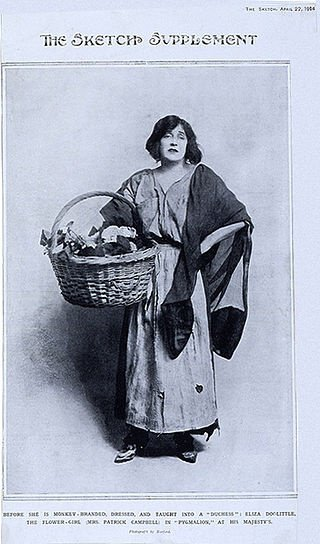

# __1965 ELIZA__
### __Joseph Weizenbaum__ (1923–2008)
___

ELIZA, dinamai sesuai karakter Eliza Doolittle dalam drama Pygmalion karya George Bernard Shaw, adalah program pertama yang dapat berkomunikasi dalam bahasa Inggris. Dibutuhkan sebaris teks yang diketik manusia pada teleprinter, mengubah teks—misalnya, mengubah Anda menjadi saya dan saya menjadi Anda—dan kemudian mengirim kembali teks tersebut ke juru ketik manusia. Sama seperti burung beo, komputer tidak tahu apa yang dikatakannya.

Profesor MIT Joseph Weizenbaum memodelkan "program analisis bahasa" pada psikoterapi Rogerian, sejenis terapi nondirektif yang tidak melibatkan interpretasi pernyataan klien. Mengikuti teknik ini, ELIZA mengubah "Saya tidak bahagia" menjadi "APAKAH ANDA BERPIKIR DATANG KE SINI AKAN MEMBANTU ANDA TIDAK BAHAGIA?" Sebagian besar transformasi ini dipicu oleh kata kunci sederhana; ketika program terhenti, itu menampilkan pertanyaan yang telah diprogram.

Weizenbaum tidak siap untuk apa yang terjadi selanjutnya. Program ini menjadi sangat populer. Orang-orang mulai berbicara dengan program itu seolah-olah itu cerdas—bahkan orang-orang yang lebih tahu. Sekretaris Weizenbaum, yang tahu bahwa dia telah menulis program, memintanya untuk meninggalkan ruangan sehingga dia dapat menggunakan sistem tanpa diawasi. Dia ngeri ketika dia menemukan bahwa Weizenbaum memiliki log interaksinya dengan komputer. Seorang pengunjung MIT yang menemukannya terus berjalan mengira bahwa dia menggunakan teleprinter untuk berbicara dengan profesor lain—dan kemudian marah ketika "profesor" itu menjawab pertanyaannya dengan pertanyaan lain. Belakangan, beberapa orang mengklaim bahwa psikoterapis terkomputerisasi mungkin lebih baik dalam beberapa kasus daripada yang manusiawi — lagipula, mereka selalu tersedia dan tidak menagih per jam.

Pada intinya, ELIZA tidak tahu apa-apa tentang bahasa yang digunakannya untuk berkomunikasi. Dalam analisis terakhir, kurangnya pemahaman itu tidak masalah. “Sebagian besar keanggunan apa pun yang dapat dikreditkan ke ELIZA terletak pada kenyataan bahwa ELIZA mempertahankan ilusi pemahaman dengan begitu sedikit mesin,” tulis Weizenbaum dalam artikel 1966 tentang program. Kekuatan program bukanlah kemampuannya untuk memahami apa yang diketik seseorang, tetapi untuk menyembunyikan kurangnya pemahamannya.

*ELIZA dinamai sesuai karakter Eliza Doolittle, yang diberi pelajaran pidato di Pygmalion karya George Bernard Shaw dan kemudian adaptasi musiknya, My Fair Lady. Di sini Eliza Doolittle diperankan oleh Mrs. Patrick Campbell pada tahun 1914.*