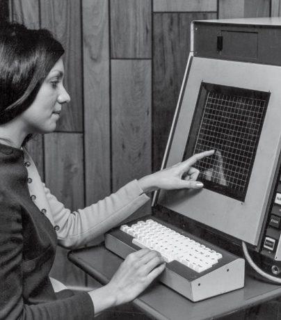

# __1965 Touchscreen__
### __E. A. Johnson__ (dates unavailable), __Dr. Sam Hurst__ (1927–2010), __Nimish Mehta__ (dates unavailable)
___

Pada tahun 1955, proyek MIT Whirlwind menciptakan pena ringan yang memungkinkan pengguna menunjukkan titik di layar komputer. Tapi bisa menunjuk lebih alami dengan jari Anda sendiri? Itulah penemuan E. A. Johnson di Royal Radar Establishment (RRE).

Johnson adalah seorang peneliti yang bekerja pada sistem kontrol lalu lintas udara RRE. Pada tahun 1965, ia menerbitkan sebuah artikel di Electronic Letters berjudul “Touch Display—A Novel Input/Output Device for Computers” yang menggambarkan layar yang peka terhadap sentuhan. Dua tahun kemudian, ia memperluas gagasannya dalam sebuah artikel di Ergonomics, menunjukkan bagaimana layar sentuh dapat digunakan untuk berinteraksi dengan grafik dan gambar.

Johnson menemukan apa yang sekarang disebut layar sentuh kapasitif. Ini menggunakan lapisan di layar untuk menyimpan muatan listrik. Saat pengguna menyentuh layar, sebagian muatan ditransfer ke pengguna. Ini mengirimkan sinyal ke sistem operasi perangkat tempat sentuhan terjadi di layar.

Beberapa tahun kemudian, Sam Hurst, seorang peneliti di Laboratorium Nasional Oak Ridge di Tennessee, menemukan sejenis film transparan yang sensitif terhadap sentuhan, tetapi yang didasarkan pada perubahan resistensi yang dihasilkan ketika dua lapisan bahan transparan ditekan bersama-sama. Tidak seperti layar kapasitif, layar sentuh dapat digunakan dengan stylus atau jari. Mereka umumnya lebih murah tetapi kurang akurat daripada layar kapasitif. Jenis layar ketiga bergantung pada perubahan gelombang ultrasonik yang dikirim melalui permukaan layar sentuh untuk mengukur di mana layar disentuh.

Layar sentuh awal hanya dapat merasakan satu sentuhan pada satu waktu. Nimish Mehta mengembangkan perangkat multitouch pertama di University of Toronto pada tahun 1982. Teknologi terus berkembang seiring dengan potensi aplikasi komersial, akhirnya mencapai massa di tahun 2000-an. Selama periode ini, itu menjadi alat yang populer untuk kolaborasi desain.

Saat ini layar sentuh adalah cara utama orang berinteraksi dengan ponsel cerdas dan tablet, yang pada tahun 2016 menjadi cara utama penduduk dunia mengakses informasi di World Wide Web.

*Layar sentuh mulai digunakan dengan banyak aplikasi. Digambarkan di sini adalah operator yang menggunakan layar sentuh pada sistem pendidikan berbasis komputer bersama PLATO (Programmed Logic Automated Teaching Operation).*