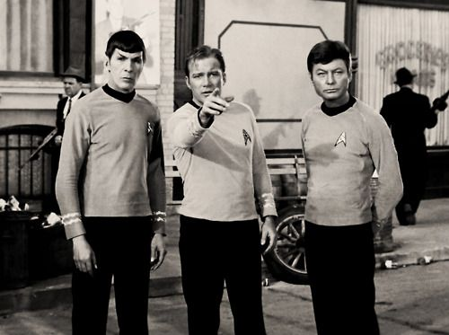

# __1966 Star Trek Premieres__
### __Gene Roddenberry__ (1921–1991), __William Shatner__ (b. 1931), __Leonard Nimoy__ (1931–2015), __Nichelle Nichols__ (b. 1932)
___

Pada tanggal 8 September 1966, National Broadcasting Company (NBC®) menayangkan perdana Star Trek, sebuah acara televisi fiksi ilmiah baru oleh Gene Roddenberry. Acara ini berlangsung dari tahun 1966 hingga 1969 dan akan tumbuh menjadi waralaba fiksi ilmiah paling berpengaruh dalam sejarah, yang pada akhirnya menghasilkan 7 acara TV yang berbeda, 13 film, dan lebih banyak kontribusi untuk budaya populer  “Beam me up, Scotty!” daripada yang bisa diukur secara akurat. Pada saat perang dan ketakutan akan teknologi yang tidak terkendali menjadi ketakutan sehari-hari, Star Trek memamerkan visi masa depan alternatif di mana umat manusia telah berevolusi dan mengatasi kemiskinan dan kebutuhan material, memanfaatkan teknologi untuk mengatasi berbagai tantangan.

Komputer dan robot memainkan peran penting dalam banyak episode Star Trek. Enterprise dilengkapi dengan komputer kapal yang memelihara penyimpanan informasi besar-besaran, menawarkan aksesibilitas universal di seluruh kapal, dan merespons perintah manusia dengan suara. Sementara itu, kru menghadapi masyarakat yang membuat perang dengan komputer dan peradaban yang diperintah oleh komputer, serta robot yang melahap planet, mengirim orang kembali melalui waktu, atau bermanifestasi dalam bentuk humanoid.

Serial aslinya mendokumentasikan banyak pengalaman pertama, termasuk menunjukkan wanita pertama dalam posisi otoritas, ciuman antar ras pertama yang disiarkan televisi—Kapten Kirk (William Shatner) dan Letnan Uhura (Nichelle Nichols)—dan seri pertama dari alur cerita yang menggunakan tabir fiksi ilmiah untuk menarik analogi dengan peristiwa terkini yang melibatkan perang dan diskriminasi yang seharusnya dilarang oleh sensor TV saat itu. Makhluk asing dan kru jembatan multietnis, termasuk alien Mr. Spock (Leonard Nimoy), sering digambarkan bekerja sama untuk memecahkan masalah, menggambar perbandingan halus dengan masalah moral dan etika tentang Perang Vietnam dan hak-hak perempuan yang ada dalam kesadaran publik di waktu.

*McCoy (DeForest Kelley), Kapten Kirk (William Shatner), dan Mr. Spock (Leonard Nimoy) di platform pengangkut di atas USS Enterprise Star Trek.*