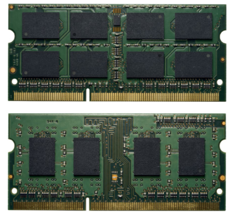

# __1966 Dynamic RAM__
### __Robert H. Dennard__ (b. 1932)
___

Sejak awal, ingatan kecil membatasi apa yang dapat dilakukan komputer. Disebut random access memory (RAM) karena lokasi mana pun dapat dibaca atau ditulis kapan saja, memori itu sangat mahal. Dan karena pemrogram sering kali tidak memiliki cukup memori untuk bekerja, mereka harus membagi program dan data mereka menjadi beberapa segmen, menyalin satu segmen ke dalam memori, memprosesnya, dan kemudian menyimpan hasilnya pada pita.

Masukkan semikonduktor. Lebih kecil dan lebih murah daripada memori inti, semikonduktor adalah teknologi berikutnya yang jelas digunakan untuk RAM. IBM menugaskan insinyur listrik Robert Dennard tugas merancang sistem memori elektronik generasi berikutnya. Pendekatan asli Dennard menggunakan enam transistor untuk membuat saklar elektronik, yang disebut flip-flop, untuk menyimpan setiap bit. Tetapi di tengah proyek pada tahun 1966, Dennard menyadari bahwa dia dapat membuat perangkat lebih murah dengan menyimpan setiap bit dalam kapasitor — perangkat yang menyimpan muatan — dan menggunakan satu transistor untuk menyimpan muatan dan membacanya kembali ketika data telah disimpan. diperlukan. Namun, ada masalah: kapasitor membocorkan muatannya. Solusinya adalah me-refresh bit, mungkin seribu kali setiap detik, dengan membaca bit dan menulisnya kembali. Karena muatan akan terus bergerak, Dennard menggambarkan penemuannya sebagai memori akses acak dinamis (DRAM).

IBM berkomitmen untuk menyelesaikan desain yang menggunakan enam transistor—desain yang sekarang disebut static random access memory (SRAM)—jadi Dennard mengejar DRAM sebagai proyek sampingan. Akhirnya, pada tahun 1967, IBM mengajukan paten untuk DRAM, yang diberikan pada tahun 1968.

Perusahaan yang akhirnya mengkomersialkan DRAM bukanlah IBM, tetapi Intel, yang menggunakan desain tiga transistor yang kurang efisien yang dilisensikan dari Honeywell, sebuah perusahaan teknologi Amerika. Dirilis pada tahun 1970, Intel 1103 adalah DRAM pertama yang tersedia secara komersial. Ini menyimpan 1024 bit dan menawarkan harga yang lebih baik dan kinerja yang lebih baik daripada memori inti magnetik.

Sejak itu, penyimpanan DRAM telah meningkat seiring dengan menyusutnya ukuran transistor. Pada awal 1990-an, produsen menempatkan satu juta bit penyimpanan pada sebuah chip; pada tahun 2000-an, satu miliar bit. Saat ini tingkat kemajuan telah melambat, dan chip DRAM modern dapat menampung "hanya" 4 miliar hingga 32 miliar bit.

*Chip memori RAM dinamis dirakit pada modul memori inline ganda (DIMM), format yang banyak digunakan di laptop modern.*
